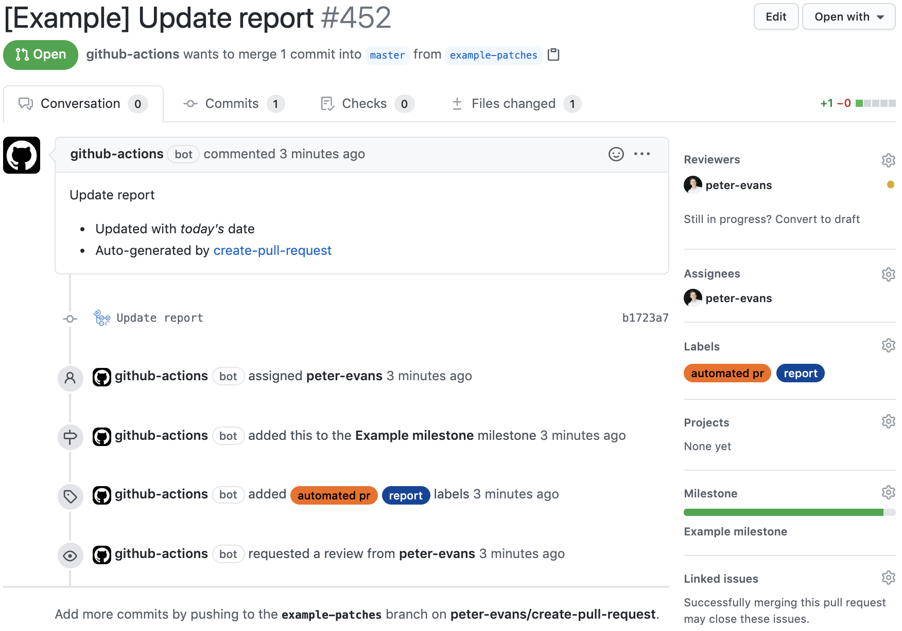

#  Create Pull Request
[](https://github.com/peter-evans/create-pull-request/actions?query=workflow%3ACI)
[](https://github.com/marketplace/actions/create-pull-request)

A GitHub action to create a pull request for changes to your repository in the actions workspace.

Changes to a repository in the Actions workspace persist between steps in a workflow.
This action is designed to be used in conjunction with other steps that modify or add files to your repository.
The changes will be automatically committed to a new branch and a pull request created.

Create Pull Request action will:

1. Check for repository changes in the Actions workspace. This includes:
   - untracked (new) files
   - tracked (modified) files
   - commits made during the workflow that have not been pushed
2. Commit all changes to a new branch, or update an existing pull request branch.
3. Create a pull request to merge the new branch into the base&mdash;the branch checked out in the workflow.

## Documentation

- [Concepts, guidelines and advanced usage](docs/concepts-guidelines.md)
- [Examples](docs/examples.md)
- [Updating to v4](docs/updating.md)

## Usage

```yml
      - uses: actions/checkout@v3

      # Make changes to pull request here

      - name: Create Pull Request
        uses: peter-evans/create-pull-request@v4
```

You can also pin to a [specific release](https://github.com/peter-evans/create-pull-request/releases) version in the format `@v4.x.x`

### Action inputs

All inputs are **optional**. If not set, sensible defaults will be used.

**Note**: If you want pull requests created by this action to trigger an `on: push` or `on: pull_request` workflow then you cannot use the default `GITHUB_TOKEN`. See the [documentation here](docs/concepts-guidelines.md#triggering-further-workflow-runs) for workarounds.

| Name | Description | Default |
| --- | --- | --- |
| `token` | `GITHUB_TOKEN` (permissions `contents: write` and `pull-requests: write`) or a `repo` scoped [Personal Access Token (PAT)](https://docs.github.com/en/github/authenticating-to-github/creating-a-personal-access-token). | `GITHUB_TOKEN` |
| `path` | Relative path under `GITHUB_WORKSPACE` to the repository. | `GITHUB_WORKSPACE` |
| `add-paths` | A comma or newline-separated list of file paths to commit. Paths should follow git's [pathspec](https://git-scm.com/docs/gitglossary#Documentation/gitglossary.txt-aiddefpathspecapathspec) syntax. If no paths are specified, all new and modified files are added. See [Add specific paths](#add-specific-paths). | |
| `commit-message` | The message to use when committing changes. | `[create-pull-request] automated change` |
| `committer` | The committer name and email address in the format `Display Name <email@address.com>`. Defaults to the GitHub Actions bot user. | `GitHub <noreply@github.com>` |
| `author` | The author name and email address in the format `Display Name <email@address.com>`. Defaults to the user who triggered the workflow run. | `${{ github.actor }} <${{ github.actor }}@users.noreply.github.com>` |
| `signoff` | Add [`Signed-off-by`](https://git-scm.com/docs/git-commit#Documentation/git-commit.txt---signoff) line by the committer at the end of the commit log message. | `false` |
| `branch` | The pull request branch name. | `create-pull-request/patch` |
| `delete-branch` | Delete the `branch` when closing pull requests, and when undeleted after merging. Recommend `true`. | `false` |
| `branch-suffix` | The branch suffix type when using the alternative branching strategy. Valid values are `random`, `timestamp` and `short-commit-hash`. See [Alternative strategy](#alternative-strategy---always-create-a-new-pull-request-branch) for details. | |
| `base` | Sets the pull request base branch. | Defaults to the branch checked out in the workflow. |
| `push-to-fork` | A fork of the checked-out parent repository to which the pull request branch will be pushed. e.g. `owner/repo-fork`. The pull request will be created to merge the fork's branch into the parent's base. See [push pull request branches to a fork](docs/concepts-guidelines.md#push-pull-request-branches-to-a-fork) for details. | |
| `title` | The title of the pull request. | `Changes by create-pull-request action` |
| `body` | The body of the pull request. | `Automated changes by [create-pull-request](https://github.com/peter-evans/create-pull-request) GitHub action` |
| `labels` | A comma or newline-separated list of labels. | |
| `assignees` | A comma or newline-separated list of assignees (GitHub usernames). | |
| `reviewers` | A comma or newline-separated list of reviewers (GitHub usernames) to request a review from. | |
| `team-reviewers` | A comma or newline-separated list of GitHub teams to request a review from. Note that a `repo` scoped [PAT](https://docs.github.com/en/github/authenticating-to-github/creating-a-personal-access-token) may be required. See [this issue](https://github.com/peter-evans/create-pull-request/issues/155). If using a GitHub App, refer to [Authenticating with GitHub App generated tokens](docs/concepts-guidelines.md#authenticating-with-github-app-generated-tokens) for the proper permissions. | |
| `milestone` | The number of the milestone to associate this pull request with. | |
| `draft` | Create a [draft pull request](https://docs.github.com/en/github/collaborating-with-issues-and-pull-requests/about-pull-requests#draft-pull-requests). It is not possible to change draft status after creation except through the web interface. | `false` |

For self-hosted runners behind a corporate proxy set the `https_proxy` environment variable.
```yml
      - name: Create Pull Request
        uses: peter-evans/create-pull-request@v4
        env:
          https_proxy: http://<proxy_address>:<port>
```

### Action outputs

The following outputs can be used by subsequent workflow steps.

- `pull-request-number` - The pull request number.
- `pull-request-url` - The URL of the pull request.
- `pull-request-operation` - The pull request operation performed by the action, `created`, `updated` or `closed`.
- `pull-request-head-sha` - The commit SHA of the pull request branch.

Step outputs can be accessed as in the following example.
Note that in order to read the step outputs the action step must have an id.

```yml
      - name: Create Pull Request
        id: cpr
        uses: peter-evans/create-pull-request@v4
      - name: Check outputs
        if: ${{ steps.cpr.outputs.pull-request-number }}
        run: |
          echo "Pull Request Number - ${{ steps.cpr.outputs.pull-request-number }}"
          echo "Pull Request URL - ${{ steps.cpr.outputs.pull-request-url }}"
```

### Action behaviour

The default behaviour of the action is to create a pull request that will be continually updated with new changes until it is merged or closed.
Changes are committed and pushed to a fixed-name branch, the name of which can be configured with the `branch` input.
Any subsequent changes will be committed to the *same* branch and reflected in the open pull request.

How the action behaves:

- If there are changes (i.e. a diff exists with the checked-out base branch), the changes will be pushed to a new `branch` and a pull request created.
- If there are no changes (i.e. no diff exists with the checked-out base branch), no pull request will be created and the action exits silently.
- If a pull request already exists and there are no further changes (i.e. no diff with the current pull request branch) then the action exits silently.
- If a pull request exists and new changes on the base branch make the pull request unnecessary (i.e. there is no longer a diff between the pull request branch and the base), the pull request is automatically closed. Additionally, if `delete-branch` is set to `true` the `branch` will be deleted.

For further details about how the action works and usage guidelines, see [Concepts, guidelines and advanced usage](docs/concepts-guidelines.md).

#### Alternative strategy - Always create a new pull request branch

For some use cases it may be desirable to always create a new unique branch each time there are changes to be committed.
This strategy is *not recommended* because if not used carefully it could result in multiple pull requests being created unnecessarily. If in doubt, use the [default strategy](#action-behaviour) of creating an updating a fixed-name branch.

To use this strategy, set input `branch-suffix` with one of the following options.

- `random` - Commits will be made to a branch suffixed with a random alpha-numeric string. e.g. `create-pull-request/patch-6qj97jr`, `create-pull-request/patch-5jrjhvd`

- `timestamp` - Commits will be made to a branch suffixed by a timestamp. e.g. `create-pull-request/patch-1569322532`, `create-pull-request/patch-1569322552`

- `short-commit-hash` - Commits will be made to a branch suffixed with the short SHA1 commit hash. e.g. `create-pull-request/patch-fcdfb59`, `create-pull-request/patch-394710b`

### Controlling committed files

The action defaults to adding all new and modified files.
If there are files that should not be included in the pull request, you can use the following methods to control the committed content.

#### Remove files

The most straightforward way to handle unwanted files is simply to remove them in a step before the action runs.

```yml
      - run: |
          rm -rf temp-dir
          rm temp-file.txt
```

#### Ignore files

If there are files or directories you want to ignore you can simply add them to a `.gitignore` file at the root of your repository. The action will respect this file.

#### Add specific paths

You can control which files are committed with the `add-paths` input.
Paths should follow git's [pathspec](https://git-scm.com/docs/gitglossary#Documentation/gitglossary.txt-aiddefpathspecapathspec) syntax.
All file changes that do not match one of the paths will be discarded.

```yml
      - name: Create Pull Request
        uses: peter-evans/create-pull-request@v4
        with:
          add-paths: |
            *.java
            docs/*.md
```

#### Create your own commits

As well as relying on the action to handle uncommitted changes, you can additionally make your own commits before the action runs.
Note that the repository must be checked out on a branch with a remote, it won't work for [events which checkout a commit](docs/concepts-guidelines.md#events-which-checkout-a-commit).

```yml
    steps:
      - uses: actions/checkout@v3
      - name: Create commits
        run: |
          git config user.name 'Peter Evans'
          git config user.email 'peter-evans@users.noreply.github.com'
          date +%s > report.txt
          git commit -am "Modify tracked file during workflow"
          date +%s > new-report.txt
          git add -A
          git commit -m "Add untracked file during workflow"
      - name: Uncommitted change
        run: date +%s > report.txt
      - name: Create Pull Request
        uses: peter-evans/create-pull-request@v4
```

### Create a project card

To create a project card for the pull request, pass the `pull-request-number` step output to [create-or-update-project-card](https://github.com/peter-evans/create-or-update-project-card) action.

```yml
      - name: Create Pull Request
        id: cpr
        uses: peter-evans/create-pull-request@v4

      - name: Create or Update Project Card
        if: ${{ steps.cpr.outputs.pull-request-number }}
        uses: peter-evans/create-or-update-project-card@v2
        with:
          project-name: My project
          column-name: My column
          issue-number: ${{ steps.cpr.outputs.pull-request-number }}
```

### Auto-merge

Auto-merge can be enabled on a pull request allowing it to be automatically merged once requirements have been satisfied.
See [enable-pull-request-automerge](https://github.com/peter-evans/enable-pull-request-automerge) action for usage details.

## Reference Example

The following workflow sets many of the action's inputs for reference purposes.
Check the [defaults](#action-inputs) to avoid setting inputs unnecessarily.

See [examples](docs/examples.md) for more realistic use cases.

```yml
jobs:
  createPullRequest:
    runs-on: ubuntu-latest
    steps:
      - uses: actions/checkout@v3

      - name: Make changes to pull request
        run: date +%s > report.txt

      - name: Create Pull Request
        id: cpr
        uses: peter-evans/create-pull-request@v4
        with:
          token: ${{ secrets.PAT }}
          commit-message: Update report
          committer: GitHub <noreply@github.com>
          author: ${{ github.actor }} <${{ github.actor }}@users.noreply.github.com>
          signoff: false
          branch: example-patches
          delete-branch: true
          title: '[Example] Update report'
          body: |
            Update report
            - Updated with *today's* date
            - Auto-generated by [create-pull-request][1]

            [1]: https://github.com/peter-evans/create-pull-request
          labels: |
            report
            automated pr
          assignees: peter-evans
          reviewers: peter-evans
          team-reviewers: |
            owners
            maintainers
          milestone: 1
          draft: false
```

An example based on the above reference configuration creates pull requests that look like this:



## License

[MIT](LICENSE)
