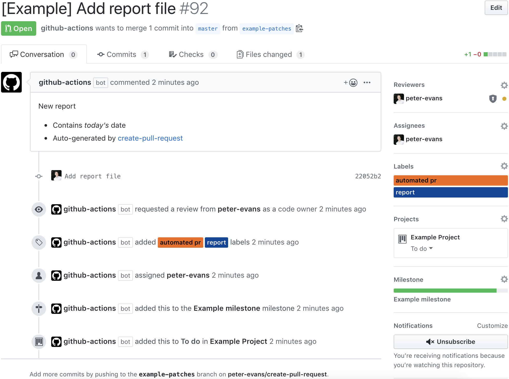

#  Create Pull Request
[](https://github.com/marketplace/actions/create-pull-request)

A GitHub action to create a pull request for changes to your repository in the actions workspace.

Changes to a repository in the Actions workspace persist between steps in a workflow.
This action is designed to be used in conjunction with other steps that modify or add files to your repository.
The changes will be automatically committed to a new branch and a pull request created.

Create Pull Request action will:

1. Check for repository changes in the Actions workspace. This includes untracked (new) files as well as modified files.
2. Commit all changes to a new branch, or update an existing pull request branch.
3. Create a pull request to merge the new branch into the currently active branch executing the workflow.

## Usage

Linux
```yml
      - name: Create Pull Request
        uses: peter-evans/create-pull-request@v1.6.0
        env:
          GITHUB_TOKEN: ${{ secrets.GITHUB_TOKEN }}
```

Multi platform - Linux, MacOS, Windows (beta)
```yml
      - name: Create Pull Request
        uses: peter-evans/create-pull-request@v1.6.0-multi
        env:
          GITHUB_TOKEN: ${{ secrets.GITHUB_TOKEN }}
```

**Note**: If you want pull requests created by this action to trigger an `on: pull_request` workflow then you must use a [Personal Access Token](https://help.github.com/en/articles/creating-a-personal-access-token-for-the-command-line) instead of the default `GITHUB_TOKEN`.
See [this issue](https://github.com/peter-evans/create-pull-request/issues/48) for further details.

### Environment variables

These variables are *all optional*. If not set, sensible default values will be used.

| Name | Description | Default |
| --- | --- | --- |
| `COMMIT_MESSAGE` | The message to use when committing changes. | `Auto-committed changes by create-pull-request action` |
| `COMMIT_AUTHOR_EMAIL` | The email address of the commit author. | For `push` events, the HEAD commit author. Otherwise, <GITHUB_ACTOR>@users.noreply.github.com, where `GITHUB_ACTOR` is the GitHub user that initiated the event. |
| `COMMIT_AUTHOR_NAME` | The name of the commit author. | For `push` events, the HEAD commit author. Otherwise, <GITHUB_ACTOR>, the GitHub user that initiated the event. |
| `PULL_REQUEST_TITLE` | The title of the pull request. | `Auto-generated by create-pull-request action` |
| `PULL_REQUEST_BODY` | The body of the pull request. | `Auto-generated pull request by [create-pull-request](https://github.com/peter-evans/create-pull-request) GitHub Action` |
| `PULL_REQUEST_LABELS` | A comma separated list of labels. | none |
| `PULL_REQUEST_ASSIGNEES` | A comma separated list of assignees (GitHub usernames). | none |
| `PULL_REQUEST_REVIEWERS` | A comma separated list of reviewers (GitHub usernames) to request a review from. | none |
| `PULL_REQUEST_TEAM_REVIEWERS` | A comma separated list of GitHub teams to request a review from. | none |
| `PULL_REQUEST_MILESTONE` | The number of the milestone to associate this pull request with. | none |
| `PULL_REQUEST_BRANCH` | The branch name. See **Branch naming** below for details. | `create-pull-request/patch` |
| `PULL_REQUEST_BASE` | Overrides the base branch. **Use with caution!** | Defaults to the currently checked out branch. |
| `BRANCH_SUFFIX` | The branch suffix type. Valid values are `short-commit-hash`, `timestamp`, `random` and `none`. See **Branch naming** below for details. | `short-commit-hash` |

**Output environment variables**

- `PULL_REQUEST_NUMBER` - The number of the pull request created.

**Debug environment variables**

The following parameter is available for debugging and troubleshooting.

- `DEBUG_EVENT` - If present, outputs the event data that triggered the workflow.

### Branch naming

For branch naming there are two strategies. Always create a new branch each time there are changes to be committed, OR, create a fixed-name pull request branch that will be updated with any new commits until it is merged or closed.

#### Strategy A - Always create a new pull request branch (default)

For this strategy there are three options to suffix the branch name.
The branch name is defined by the variable `PULL_REQUEST_BRANCH` and defaults to `create-pull-request/patch`. The following options are values for `BRANCH_SUFFIX`.

- `short-commit-hash` (default) - Commits will be made to a branch suffixed with the short SHA1 commit hash. e.g. `create-pull-request/patch-fcdfb59`, `create-pull-request/patch-394710b`

- `timestamp` - Commits will be made to a branch suffixed by a timestamp. e.g. `create-pull-request/patch-1569322532`, `create-pull-request/patch-1569322552`

- `random` - Commits will be made to a branch suffixed with a random alpha-numeric string. This option should be used if multiple pull requests will be created during the execution of a workflow. e.g. `create-pull-request/patch-6qj97jr`, `create-pull-request/patch-5jrjhvd`

#### Strategy B - Create and update a pull request branch

To use this strategy, set `BRANCH_SUFFIX` to the value `none`. The variable `PULL_REQUEST_BRANCH` defaults to `create-pull-request/patch`. Commits will be made to this branch and a pull request created. Any subsequent changes will be committed to the *same* branch and reflected in the existing pull request.

### Ignoring files

If there are files or directories you want to ignore you can simply add them to a `.gitignore` file at the root of your repository. The action will respect this file.

## Examples

This first example workflow is a reference example that sets all the main environment variables.
See further examples below for more realistic use cases.

```yml
name: Create Pull Request
on: push
jobs:
  createPullRequest:
    runs-on: ubuntu-latest
    steps:
      - uses: actions/checkout@v1
      - name: Create report file
        run: date +%s > report.txt
      - name: Create Pull Request
        uses: peter-evans/create-pull-request@v1.6.0
        env:
          GITHUB_TOKEN: ${{ secrets.GITHUB_TOKEN }}
          COMMIT_MESSAGE: Add report file
          COMMIT_AUTHOR_EMAIL: peter-evans@users.noreply.github.com
          COMMIT_AUTHOR_NAME: Peter Evans
          PULL_REQUEST_TITLE: '[Example] Add report file'
          PULL_REQUEST_BODY: |
            New report
            - Contains *today's* date
            - Auto-generated by [create-pull-request][1]

            [1]: https://github.com/peter-evans/create-pull-request
          PULL_REQUEST_LABELS: report, automated pr
          PULL_REQUEST_ASSIGNEES: peter-evans
          PULL_REQUEST_REVIEWERS: peter-evans
          PULL_REQUEST_MILESTONE: 1
          PULL_REQUEST_BRANCH: example-patches
          BRANCH_SUFFIX: short-commit-hash
      - name: Check output environment variable
        run: echo "Pull Request Number - $PULL_REQUEST_NUMBER"
```

This configuration will create pull requests that look like this:




### Use case: Create a pull request to update X periodically

This example workflow executes once a week and will create a pull request for any dependency updates.
This pattern will work well for updating any kind of static content from an external source.

```yml
name: Update Dependencies
on:
  schedule:
    - cron:  '0 10 * * 1'
jobs:
  update-deps:
    runs-on: ubuntu-latest
    steps:
      - uses: actions/checkout@v1
      - uses: actions/setup-node@v1
        with:
          node-version: '10.x'
      - name: Update dependencies
        id: vars
        run: |
          npm install -g npm-check-updates
          ncu -u
          npm install
      - name: Create Pull Request
        uses: peter-evans/create-pull-request@v1.6.0
        env:
          GITHUB_TOKEN: ${{ secrets.GITHUB_TOKEN }}
          COMMIT_MESSAGE: update dependencies
          COMMIT_AUTHOR_EMAIL: peter-evans@users.noreply.github.com
          COMMIT_AUTHOR_NAME: Peter Evans
          PULL_REQUEST_TITLE: Automated Dependency Updates
          PULL_REQUEST_BODY: This is an auto-generated PR with dependency updates.
          PULL_REQUEST_LABELS: dep-updates, automated pr
          PULL_REQUEST_REVIEWERS: peter-evans
          PULL_REQUEST_BRANCH: dep-updates
          BRANCH_SUFFIX: none
```

### Use case: Create a pull request to modify/fix pull requests

The following is an example workflow for a use case where [autopep8 action](https://github.com/peter-evans/autopep8) runs as both a check on pull requests and raises a further pull request to apply code fixes. This is a pattern that would work well for any automated code linting and fixing.

How it works:

1. When a pull request is raised the workflow executes as a check
2. If autopep8 makes any fixes a pull request will be raised for those fixes to be merged into the current pull request branch. The workflow then deliberately causes the check to fail.
3. When the pull request containing the fixes is merged the workflow runs again. This time autopep8 makes no changes and the check passes.
4. The original pull request can now be merged.

```yml
name: autopep8
on: pull_request
jobs:
  autopep8:
    if: startsWith(github.head_ref, 'autopep8-patches') == false
    runs-on: ubuntu-latest
    steps:
      - uses: actions/checkout@v1
      - name: autopep8
        id: autopep8
        uses: peter-evans/autopep8@v1.1.0
        with:
          args: --exit-code --recursive --in-place --aggressive --aggressive .
      - name: Set autopep8 branch name
        id: vars
        run: echo ::set-output name=branch-name::"autopep8-patches/$GITHUB_HEAD_REF"
      - name: Create Pull Request
        if: steps.autopep8.outputs.exit-code == 2
        uses: peter-evans/create-pull-request@v1.6.0
        env:
          GITHUB_TOKEN: ${{ secrets.GITHUB_TOKEN }}
          COMMIT_MESSAGE: autopep8 action fixes
          COMMIT_AUTHOR_EMAIL: peter-evans@users.noreply.github.com
          COMMIT_AUTHOR_NAME: Peter Evans
          PULL_REQUEST_TITLE: Fixes by autopep8 action
          PULL_REQUEST_BODY: This is an auto-generated PR with fixes by autopep8.
          PULL_REQUEST_LABELS: autopep8, automated pr
          PULL_REQUEST_REVIEWERS: peter-evans
          PULL_REQUEST_BRANCH: ${{ steps.vars.outputs.branch-name }}
          BRANCH_SUFFIX: none
      - name: Fail if autopep8 made changes
        if: steps.autopep8.outputs.exit-code == 2
        run: exit 1
```

### Filtering push events

For workflows using `on: push` you may want to ignore push events for tags and remotes.
These can be filtered out with the following `if` condition.

```yml
name: Create Pull Request
on: push
jobs:
  createPullRequest:
    if: startsWith(github.ref, 'refs/heads/')
    runs-on: ubuntu-latest
    steps:
      - uses: actions/checkout@v1
      ...
```

### Dynamic configuration using variables

The following examples show how configuration for the action can be dynamically defined in a previous workflow step.

The recommended method is to use `set-output`. Note that the step where output variables are defined must have an id.

```yml
      - name: Set output variables
        id: vars
        run: |
          echo ::set-output name=pr_title::"[Test] Add report file $(date +%d-%m-%Y)"
          echo ::set-output name=pr_body::"This PR was auto-generated on $(date +%d-%m-%Y) \
            by [create-pull-request](https://github.com/peter-evans/create-pull-request)."
      - name: Create Pull Request
        uses: peter-evans/create-pull-request@v1.6.0
        env:
          GITHUB_TOKEN: ${{ secrets.GITHUB_TOKEN }}
          PULL_REQUEST_TITLE: ${{ steps.vars.outputs.pr_title }}
          PULL_REQUEST_BODY: ${{ steps.vars.outputs.pr_body }}
```

Since the action reads environment variables from the system, it's technically not necessary to explicitly pass them as long as they exist in the environment. So the following method using `set-env` *also* works, but explicitly passing the configuration parameters using the previous method is perferred for its clarity.

```yml
      - name: Set environment variables
        run: |
          echo ::set-env name=PULL_REQUEST_TITLE::"[Test] Add report file $(date +%d-%m-%Y)"
          echo ::set-env name=PULL_REQUEST_BODY::"This PR was auto-generated on $(date +%d-%m-%Y) \
            by [create-pull-request](https://github.com/peter-evans/create-pull-request)."
      - name: Create Pull Request
        uses: peter-evans/create-pull-request@v1.6.0
        env:
          GITHUB_TOKEN: ${{ secrets.GITHUB_TOKEN }}
```

## License

[MIT](LICENSE)
