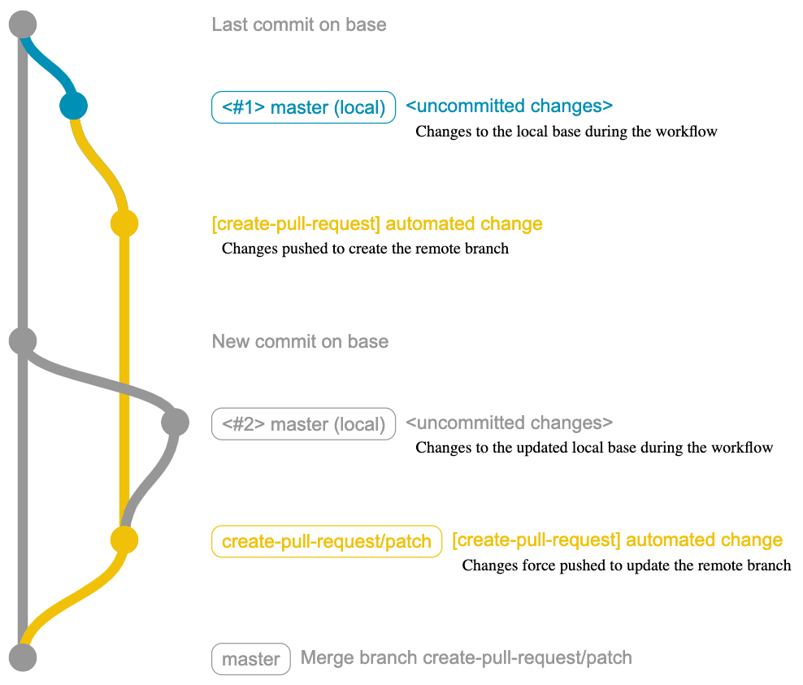

# Concepts, guidelines and advanced usage

This document covers terminology, how the action works, general usage guidelines, and advanced usage.

- [Terminology](#terminology)
- [Events and checkout](#events-and-checkout)
- [How the action works](#how-the-action-works)
- [Guidelines](#guidelines)
  - [Providing a consistent base](#providing-a-consistent-base)
  - [Events which checkout a commit](#events-which-checkout-a-commit)
  - [Restrictions on repository forks](#restrictions-on-repository-forks)
  - [Triggering further workflow runs](#triggering-further-workflow-runs)
  - [Security](#security)
- [Advanced usage](#advanced-usage)
  - [Creating pull requests in a remote repository](#creating-pull-requests-in-a-remote-repository)
  - [Push using SSH (deploy keys)](#push-using-ssh-deploy-keys)
  - [Push pull request branches to a fork](#push-pull-request-branches-to-a-fork)
  - [Authenticating with GitHub App generated tokens](#authenticating-with-github-app-generated-tokens)
  - [GPG commit signature verification](#gpg-commit-signature-verification)
  - [Running in a container or on self-hosted runners](#running-in-a-container-or-on-self-hosted-runners)

## Terminology

[Pull requests](https://docs.github.com/en/github/collaborating-with-issues-and-pull-requests/about-pull-requests#about-pull-requests) are proposed changes to a repository branch that can be reviewed by a repository's collaborators before being accepted or rejected. 

A pull request references two branches:

- The `base` of a pull request is the branch you intend to change once the proposed changes are merged.
- The `branch` of a pull request represents what you intend the `base` to look like when merged. It is the `base` branch *plus* changes that have been made to it.

## Events and checkout

This action expects repositories to be checked out with the official GitHub Actions [checkout](https://github.com/actions/checkout) action.
For each [event type](https://docs.github.com/en/actions/reference/events-that-trigger-workflows) there is a default `GITHUB_SHA` that will be checked out.

The default can be overridden by specifying a `ref` on checkout.

```yml
      - uses: actions/checkout@v3
        with:
          ref: develop
```

## How the action works

Unless the `base` input is supplied, the action expects the target repository to be checked out on the pull request `base`&mdash;the branch you intend to modify with the proposed changes.

Workflow steps:

1. Checkout the `base` branch
2. Make changes
3. Execute `create-pull-request` action

The following git diagram shows how the action creates and updates a pull request branch.



## Guidelines

### Providing a consistent base

For the action to work correctly it should be executed in a workflow that checks out a *consistent* base branch. This will be the base of the pull request unless overridden with the `base` input.

This means your workflow should be consistently checking out the branch that you intend to modify once the PR is merged.

In the following example, the [`push`](https://docs.github.com/en/actions/reference/events-that-trigger-workflows#push) and [`create`](https://docs.github.com/en/actions/reference/events-that-trigger-workflows#create) events both trigger the same workflow. This will cause the checkout action to checkout inconsistent branches and commits. Do *not* do this. It will cause multiple pull requests to be created for each additional `base` the action is executed against.

```yml
on:
  push:
  create:
jobs:
  example:
    runs-on: ubuntu-latest
    steps:
      - uses: actions/checkout@v3
```

There may be use cases where it makes sense to execute the workflow on a branch that is not the base of the pull request. In these cases, the base branch can be specified with the `base` action input. The action will attempt to rebase changes made during the workflow on to the actual base.

### Events which checkout a commit

The [default checkout](#events-and-checkout) for the majority of events will leave the repository checked out on a branch.
However, some events such as `release` and `pull_request` will leave the repository in a "detached HEAD" state.
This is because they checkout a commit, not a branch.
In these cases, you *must supply* the `base` input so the action can rebase changes made during the workflow for the pull request.

Workflows triggered by [`pull_request`](https://docs.github.com/en/actions/reference/events-that-trigger-workflows#pull_request) events will by default check out a merge commit. Set the `base` input as follows to base the new pull request on the current pull request's branch.

```yml
      - uses: peter-evans/create-pull-request@v4
        with:
          base: ${{ github.head_ref }}
```

Workflows triggered by [`release`](https://docs.github.com/en/actions/reference/events-that-trigger-workflows#release) events will by default check out a tag. For most use cases, you will need to set the `base` input to the branch name of the tagged commit.

```yml
      - uses: peter-evans/create-pull-request@v4
        with:
          base: main
```

### Restrictions on repository forks

GitHub Actions have imposed restrictions on workflow runs triggered by public repository forks.
Private repositories can be configured to [enable workflows](https://docs.github.com/en/github/administering-a-repository/disabling-or-limiting-github-actions-for-a-repository#enabling-workflows-for-private-repository-forks) from forks to run without restriction.

The restrictions apply to the `pull_request` event triggered by a fork opening a pull request in the upstream repository.

- Events from forks cannot access secrets, except for the default `GITHUB_TOKEN`.
    > With the exception of GITHUB_TOKEN, secrets are not passed to the runner when a workflow is triggered from a forked repository.

    [GitHub Actions: Using encrypted secrets in a workflow](https://docs.github.com/en/actions/configuring-and-managing-workflows/creating-and-storing-encrypted-secrets#using-encrypted-secrets-in-a-workflow)

- The `GITHUB_TOKEN` has read-only access when an event is triggered by a forked repository.

   [GitHub Actions: Permissions for the GITHUB_TOKEN](https://docs.github.com/en/actions/configuring-and-managing-workflows/authenticating-with-the-github_token#permissions-for-the-github_token)

These restrictions mean that during a `pull_request` event triggered by a forked repository, actions have no write access to GitHub resources and will fail on any attempt.

A job condition can be added to prevent workflows from executing when triggered by a repository fork.

```yml
on: pull_request
jobs:
  example:
    runs-on: ubuntu-latest
    # Check if the event is not triggered by a fork
    if: github.event.pull_request.head.repo.full_name == github.repository
```

For further reading regarding the security of pull requests, see this GitHub blog post titled [Keeping your GitHub Actions and workflows secure: Preventing pwn requests](https://securitylab.github.com/research/github-actions-preventing-pwn-requests/)

### Triggering further workflow runs

Pull requests created by the action using the default `GITHUB_TOKEN` cannot trigger other workflows. If you have `on: pull_request` or `on: push` workflows acting as checks on pull requests, they will not run.

> When you use the repository's `GITHUB_TOKEN` to perform tasks, events triggered by the `GITHUB_TOKEN` will not create a new workflow run. This prevents you from accidentally creating recursive workflow runs. For example, if a workflow run pushes code using the repository's `GITHUB_TOKEN`, a new workflow will not run even when the repository contains a workflow configured to run when `push` events occur.

[GitHub Actions: Triggering a workflow from a workflow](https://docs.github.com/en/actions/using-workflows/triggering-a-workflow#triggering-a-workflow-from-a-workflow)

#### Workarounds to trigger further workflow runs

There are a number of workarounds with different pros and cons.

- Use the default `GITHUB_TOKEN` and allow the action to create pull requests that have no checks enabled. Manually close pull requests and immediately reopen them. This will enable `on: pull_request` workflows to run and be added as checks. To prevent merging of pull requests without checks erroneously, use [branch protection rules](https://docs.github.com/en/repositories/configuring-branches-and-merges-in-your-repository/defining-the-mergeability-of-pull-requests).

- Use a `repo` scoped [Personal Access Token (PAT)](https://docs.github.com/en/github/authenticating-to-github/creating-a-personal-access-token) created on an account that has write access to the repository that pull requests are being created in. This is the standard workaround and [recommended by GitHub](https://docs.github.com/en/actions/reference/events-that-trigger-workflows#triggering-new-workflows-using-a-personal-access-token). However, the PAT cannot be scoped to a specific repository so the token becomes a very sensitive secret. If this is a concern, the PAT can instead be created for a dedicated [machine account](https://docs.github.com/en/github/site-policy/github-terms-of-service#3-account-requirements) that has collaborator access to the repository. Also note that because the account that owns the PAT will be the creator of pull requests, that user account will be unable to perform actions such as request changes or approve the pull request.

- Use [SSH (deploy keys)](#push-using-ssh-deploy-keys) to push the pull request branch. This is arguably more secure than using a PAT because deploy keys can be set per repository. However, this method will only trigger `on: push` workflows.

- Use a [machine account that creates pull requests from its own fork](#push-pull-request-branches-to-a-fork). This is the most secure because the PAT created only grants access to the machine account's fork, not the main repository. This method will trigger `on: pull_request` workflows to run. Workflows triggered `on: push` will not run because the push event is in the fork.

- Use a [GitHub App to generate a token](#authenticating-with-github-app-generated-tokens) that can be used with this action. GitHub App generated tokens are more secure than using a PAT because GitHub App access permissions can be set with finer granularity and are scoped to only repositories where the App is installed. This method will trigger both `on: push` and `on: pull_request` workflows.

### Security

From a security perspective it's good practice to fork third-party actions, review the code, and use your fork of the action in workflows.
By using third-party actions directly the risk exists that it could be modified to do something malicious, such as capturing secrets.

Alternatively, use the action directly and reference the commit hash for the version you want to target.
```yml
  - uses: thirdparty/foo-action@172ec762f2ac8e050062398456fccd30444f8f30
```

This action uses [ncc](https://github.com/vercel/ncc) to compile the Node.js code and dependencies into a single JavaScript file under the [dist](https://github.com/peter-evans/create-pull-request/tree/main/dist) directory.

## Advanced usage

### Creating pull requests in a remote repository

Checking out a branch from a different repository from where the workflow is executing will make *that repository* the target for the created pull request. In this case, a `repo` scoped [Personal Access Token (PAT)](https://docs.github.com/en/github/authenticating-to-github/creating-a-personal-access-token) is required.

```yml
      - uses: actions/checkout@v3
        with:
          token: ${{ secrets.PAT }}
          repository: owner/repo

      # Make changes to pull request here

      - uses: peter-evans/create-pull-request@v4
        with:
          token: ${{ secrets.PAT }}
```

### Push using SSH (deploy keys)

[Deploy keys](https://developer.github.com/v3/guides/managing-deploy-keys/#deploy-keys) can be set per repository and so are arguably more secure than using a `repo` scoped [Personal Access Token (PAT)](https://docs.github.com/en/github/authenticating-to-github/creating-a-personal-access-token).
Allowing the action to push with a configured deploy key will trigger `on: push` workflows. This makes it an alternative to using a PAT to trigger checks for pull requests.
Note that you cannot use deploy keys alone to [create a pull request in a remote repository](#creating-pull-requests-in-a-remote-repository) because then using a PAT would become a requirement. This method only makes sense if creating a pull request in the repository where the workflow is running.

How to use SSH (deploy keys) with create-pull-request action:

1. [Create a new SSH key pair](https://docs.github.com/en/github/authenticating-to-github/generating-a-new-ssh-key-and-adding-it-to-the-ssh-agent#generating-a-new-ssh-key) for your repository. Do not set a passphrase.
2. Copy the contents of the public key (.pub file) to a new repository [deploy key](https://developer.github.com/v3/guides/managing-deploy-keys/#deploy-keys) and check the box to "Allow write access."
3. Add a secret to the repository containing the entire contents of the private key.
4. As shown in the example below, configure `actions/checkout` to use the deploy key you have created.

```yml
    steps:
      - uses: actions/checkout@v3
        with:
          ssh-key: ${{ secrets.SSH_PRIVATE_KEY }}

      # Make changes to pull request here

      - name: Create Pull Request
        uses: peter-evans/create-pull-request@v4
```

### Push pull request branches to a fork

Instead of pushing pull request branches to the repository you want to update, you can push them to a fork of that repository.
This allows you to employ the [principle of least privilege](https://en.wikipedia.org/wiki/Principle_of_least_privilege) by using a dedicated user acting as a [machine account](https://docs.github.com/en/github/site-policy/github-terms-of-service#3-account-requirements).
This user only has `read` access to the main repository.
It will use their own fork to push code and create the pull request.
Note that if you choose to use this method (not give the machine account `write` access to the repository) the following inputs cannot be used: `labels`, `assignees`, `reviewers`, `team-reviewers` and `milestone`.

1. Create a new GitHub user and login.
2. Fork the repository that you will be creating pull requests in.
3. Create a [Personal Access Token (PAT)](https://docs.github.com/en/github/authenticating-to-github/creating-a-personal-access-token).
4. Logout and log back into your main user account.
5. Add a secret to your repository containing the above PAT.
6. As shown in the following example workflow, set the `push-to-fork` input to the full repository name of the fork.

```yaml
      - uses: actions/checkout@v3

      # Make changes to pull request here

      - uses: peter-evans/create-pull-request@v4
        with:
          token: ${{ secrets.MACHINE_USER_PAT }}
          push-to-fork: machine-user/fork-of-repository
```

### Authenticating with GitHub App generated tokens

A GitHub App can be created for the sole purpose of generating tokens for use with GitHub actions.
These tokens can be used in place of `GITHUB_TOKEN` or a [Personal Access Token (PAT)](https://docs.github.com/en/github/authenticating-to-github/creating-a-personal-access-token).
GitHub App generated tokens are more secure than using a PAT because GitHub App access permissions can be set with finer granularity and are scoped to only repositories where the App is installed.

1. Create a minimal [GitHub App](https://docs.github.com/en/developers/apps/creating-a-github-app), setting the following fields:

    - Set `GitHub App name`.
    - Set `Homepage URL` to anything you like, such as your GitHub profile page.
    - Uncheck `Active` under `Webhook`. You do not need to enter a `Webhook URL`.
    - Under `Repository permissions: Contents` select `Access: Read & write`.
    - Under `Repository permissions: Pull requests` select `Access: Read & write`.
    - Under `Organization permissions: Members` select `Access: Read-only`.
      - **NOTE**: Only needed if you would like add teams as reviewers to PRs.

2. Create a Private key from the App settings page and store it securely.

3. Install the App on any repository where workflows will run requiring tokens.

4. Set secrets on your repository containing the GitHub App ID, and the private key you created in step 2. e.g. `APP_ID`, `APP_PRIVATE_KEY`.

5. The following example workflow shows how to use [tibdex/github-app-token](https://github.com/tibdex/github-app-token) to generate a token for use with this action.

```yaml
    steps:
      - uses: actions/checkout@v3

      - uses: tibdex/github-app-token@v1
        id: generate-token
        with:
          app_id: ${{ secrets.APP_ID }}
          private_key: ${{ secrets.APP_PRIVATE_KEY }}

      # Make changes to pull request here

      - name: Create Pull Request
        uses: peter-evans/create-pull-request@v4
        with:
          token: ${{ steps.generate-token.outputs.token }}
```

### GPG commit signature verification

The action can use GPG to sign commits with a GPG key that you generate yourself.

1. Follow GitHub's guide to [generate a new GPG key](https://docs.github.com/en/github/authenticating-to-github/generating-a-new-gpg-key).

2. [Add the public key](https://docs.github.com/en/github/authenticating-to-github/adding-a-new-gpg-key-to-your-github-account) to the user account associated with the [Personal Access Token (PAT)](https://docs.github.com/en/github/authenticating-to-github/creating-a-personal-access-token) that you will use with the action.

3. Copy the private key to your clipboard, replacing `email@example.com` with the email address of your GPG key.
   ```
   # macOS
   gpg --armor --export-secret-key email@example.com | pbcopy
   ```

4. Paste the private key into a repository secret where the workflow will run. e.g. `GPG_PRIVATE_KEY`

5. Create another repository secret for the key's passphrase, if applicable. e.g. `GPG_PASSPHRASE`

6. The following example workflow shows how to use [crazy-max/ghaction-import-gpg](https://github.com/crazy-max/ghaction-import-gpg) to import your GPG key and allow the action to sign commits.

   Note that the `committer` email address *MUST* match the email address used to create your GPG key.

```yaml
    steps:
      - uses: actions/checkout@v3

      - uses: crazy-max/ghaction-import-gpg@v3
        with:
          gpg-private-key: ${{ secrets.GPG_PRIVATE_KEY }}
          passphrase: ${{ secrets.GPG_PASSPHRASE }}
          git-user-signingkey: true
          git-commit-gpgsign: true

      # Make changes to pull request here

      - name: Create Pull Request
        uses: peter-evans/create-pull-request@v4
        with:
          token: ${{ secrets.PAT }}
          committer: example <email@example.com>
```

### Running in a container or on self-hosted runners

This action can be run inside a container, or on [self-hosted runners](https://docs.github.com/en/actions/hosting-your-own-runners), by installing the necessary dependencies.

This action requires `git` to be installed and on the `PATH`. Note that `actions/checkout` requires Git 2.18 or higher to be installed, otherwise it will just download the source of the repository instead of cloning it.

The following examples of running in a container show the dependencies being installed during the workflow, but they could also be pre-installed in a custom image.

**Alpine container example:**
```yml
jobs:
  createPullRequestAlpine:
    runs-on: ubuntu-latest
    container:
      image: alpine
    steps:
      - name: Install dependencies
        run: apk --no-cache add git

      - uses: actions/checkout@v3

      # Make changes to pull request here

      - name: Create Pull Request
        uses: peter-evans/create-pull-request@v4
```

**Ubuntu container example:**
```yml
jobs:
  createPullRequestAlpine:
    runs-on: ubuntu-latest
    container:
      image: ubuntu
    steps:
      - name: Install dependencies
        run: |
          apt-get update
          apt-get install -y software-properties-common
          add-apt-repository -y ppa:git-core/ppa
          apt-get install -y git

      - uses: actions/checkout@v3

      # Make changes to pull request here

      - name: Create Pull Request
        uses: peter-evans/create-pull-request@v4
```
